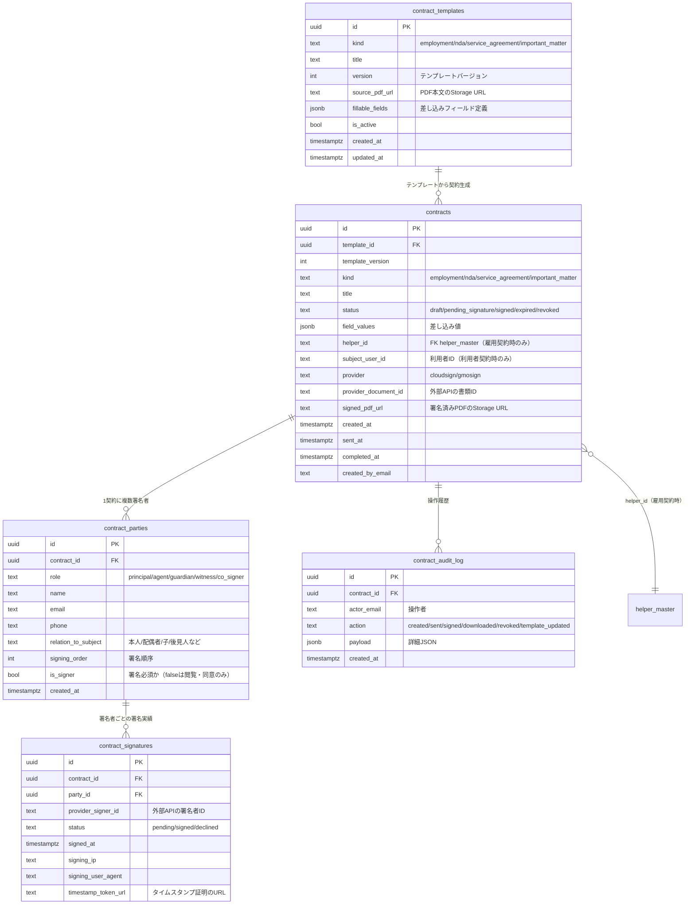
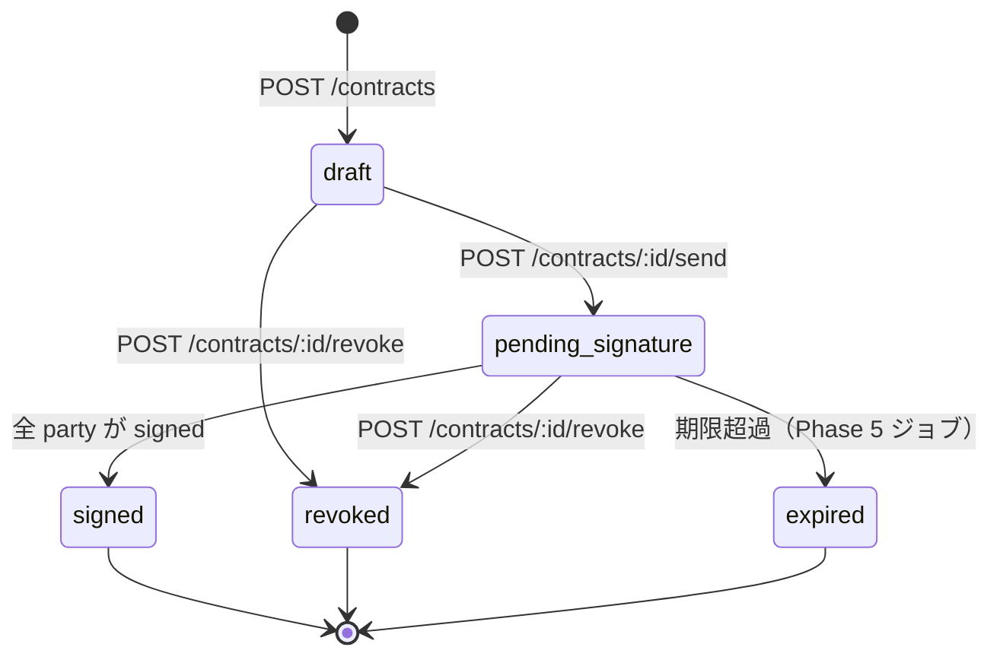
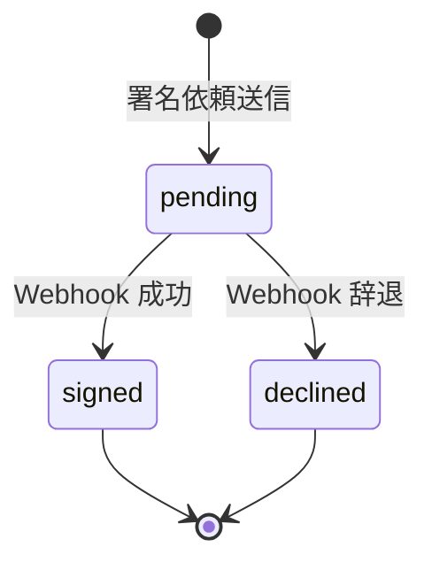

# CONTRACTS_DESIGN — 電子契約機能 全体設計書

> **位置付け**: Phase 0 で確定した方針（`CONTRACTS_PHASE0.md`）を踏まえた、DB / API / 画面 / 実装順の設計書。
> 本ドキュメントが合意されたら Phase 2（SQL）→ Phase 3（Functions）→ Phase 4（UI）に進む。
>
> **確定事項**（Phase 0 より）
> - 外部署名 API = **クラウドサイン** を第一候補とし、provider 抽象層で GMOサイン に差し替え可能
> - MVP = **ヘルパー雇用契約 + 事業所間契約の画面まで**、**利用者契約（重要事項説明書）は基盤（テーブル・API雛形）のみ**
> - 代理人署名は最初から `contract_parties` に内蔵（利用者契約で使う時の設計は済ませておく）

作成: 2026-04-19
作成者: 奥原翼 + Claude

---

## 1. データモデル

### 1.1 ER 図



### 1.2 テーブル別の設計ポイント

#### `contract_templates`
- **バージョン管理必須**: 本文改訂時は `version+1` の新レコードを作成し、古いバージョンは `is_active=false` に。過去の締結済契約は `template_version` で過去バージョンを参照できる
- `fillable_fields` の JSON 例:
  ```json
  [
    {"key": "helper_name", "label": "ヘルパー氏名", "required": true, "source": "helper_master.name"},
    {"key": "start_date", "label": "契約開始日", "required": true, "type": "date"},
    {"key": "hourly_wage", "label": "時給", "required": true, "type": "integer"}
  ]
  ```
- `source` に `helper_master.name` のような参照を書ける → 後で自動補完に使う

#### `contracts`
- `kind` は Phase 1 MVP では `employment` / `nda` / `service_agreement` / `important_matter` の4種。将来 `usage_contract`（利用契約書本体）なども追加可能
- `status` 遷移: `draft`（下書き）→ `pending_signature`（送信済・署名待ち）→ `signed`（全員署名済）→ `expired`（期限切れ）→ `revoked`（撤回）。未使用の下書きは7日で自動 `expired` にする案（Phase 5）
- `helper_id` と `subject_user_id` はどちらも nullable。雇用契約は helper_id のみ、利用者契約は subject_user_id のみ、事業所間契約はどちらも null
- **既存 `helper_master` は INSERT/UPDATE しない**（SELECT のみ）。RULES 4 に準拠

#### `contract_parties`
- 1契約に複数。`role` で区別:
  - `principal` — 本人
  - `agent` — 代理人（成年後見人 or 家族代理）
  - `guardian` — 保護者（未成年時）
  - `witness` — 立会人
  - `co_signer` — 同意者（家族同意の署名）
- `signing_order` で順序制御。0 から連番。同じ値なら並列署名可
- `is_signer=false` なら閲覧・同意署名のみ（完了フラグには含めない選択肢）

#### `contract_signatures`
- `party_id` との1対1または1対多。1対多になるのは「代理人署名＋本人同意」の二重取得のような変則運用がある場合のみ
- `timestamp_token_url` は外部API が返すタイムスタンプトークンへの URL。長期検証性の担保

#### `contract_audit_log`
- **append-only**。UPDATE/DELETE は運用で禁止
- RLS で `service_role` のみ書き込み可にする

### 1.3 既存テーブルへの影響

| 既存テーブル | 影響 | 対応 |
|---|---|---|
| `helper_master` | SELECT のみ（雇用契約の相手名取得） | 変更なし |
| `notifications` | 署名依頼の通知に流用（INSERT） | 既存の列をそのまま使う。新しい `type='contract_sign_request'` 値を追加のみ |
| `admin_users` | 契約系 API の管理者権限チェック | 既存 `adminAuth` ミドルウェアを流用 |

**RULES.md 2・3・4 すべて準拠**（既存テーブル・API への破壊的変更なし）。

---

## 2. API エンドポイント設計

ベース: `https://asia-northeast1-village-tsubasa.cloudfunctions.net/api/contracts`
認証: 既存 `adminAuth` ミドルウェアを全エンドポイントに適用（ヘルパー向けは email ベースのフィルタ）

### 2.1 テンプレート管理（管理者向け）

| メソッド | パス | 認可 | 用途 |
|---|---|---|---|
| GET | `/api/contracts/templates` | admin | テンプレート一覧 |
| GET | `/api/contracts/templates/:id` | admin | 1件取得 |
| POST | `/api/contracts/templates` | admin | 新規登録（PDF本文アップロード＋差し込みフィールド定義） |
| POST | `/api/contracts/templates/:id/new-version` | admin | バージョンアップ（本文 or フィールド変更時） |
| POST | `/api/contracts/templates/:id/deactivate` | admin | 停止（`is_active=false`） |

**POST /templates** リクエスト例:
```json
{
  "kind": "employment",
  "title": "ヘルパー雇用契約書 2026年度版",
  "source_pdf_base64": "<base64>",
  "fillable_fields": [
    {"key": "helper_name", "label": "氏名", "required": true, "source": "helper_master.name"},
    {"key": "start_date", "label": "契約開始日", "required": true, "type": "date"}
  ]
}
```

### 2.2 契約作成・送信

| メソッド | パス | 認可 | 用途 |
|---|---|---|---|
| GET | `/api/contracts` | admin / 本人 | 契約一覧（`kind` / `status` / `helper_email` 等でフィルタ） |
| GET | `/api/contracts/:id` | admin / 本人 | 契約詳細（署名者リスト・状態を含む） |
| POST | `/api/contracts` | admin | 契約ドラフト作成（テンプレートID＋差し込み値＋署名者リスト） |
| POST | `/api/contracts/:id/send` | admin | 外部API に送信して署名依頼開始（`status` を `pending_signature` へ） |
| POST | `/api/contracts/:id/revoke` | admin | 撤回（`status` を `revoked` へ、外部API側も取り消し） |
| GET | `/api/contracts/:id/download` | admin / 本人 | 署名済みPDF取得（`status=signed` のみ） |

**POST /contracts** リクエスト例（ヘルパー雇用契約）:
```json
{
  "template_id": "uuid",
  "helper_id": "helper-uuid",
  "title": "2026年4月 山田太郎 雇用契約",
  "field_values": {
    "helper_name": "山田 太郎",
    "start_date": "2026-04-01",
    "hourly_wage": 1500
  },
  "parties": [
    {"role": "principal", "name": "山田 太郎", "email": "yamada@example.com", "signing_order": 0, "is_signer": true},
    {"role": "principal", "name": "ビレッジひろば 代表", "email": "admin@village-support.jp", "signing_order": 1, "is_signer": true}
  ]
}
```

**利用者契約で代理人あり** の場合:
```json
{
  "template_id": "uuid",
  "subject_user_id": "user-uuid",
  "title": "重要事項説明書 2026年4月 佐藤花子様",
  "field_values": { ... },
  "parties": [
    {"role": "principal", "name": "佐藤 花子", "email": "", "is_signer": false, "signing_order": 0},
    {"role": "agent", "name": "佐藤 一郎（長男）", "email": "ichiro@example.com", "relation_to_subject": "子", "is_signer": true, "signing_order": 1},
    {"role": "co_signer", "name": "佐藤 二郎（次男）", "email": "jiro@example.com", "relation_to_subject": "子", "is_signer": true, "signing_order": 2}
  ]
}
```

### 2.3 外部 API との連携

| メソッド | パス | 認可 | 用途 |
|---|---|---|---|
| POST | `/api/contracts/webhook/cloudsign` | プロバイダ認証 | クラウドサインからの署名完了/辞退通知を受信 |
| POST | `/api/contracts/webhook/gmosign` | プロバイダ認証 | （将来用）GMOサインからの通知 |

Webhook は **共通ルータで受けて provider に振り分け**、`contract_signatures` / `contracts.status` / `contract_audit_log` を更新する。

### 2.4 ヘルパー向け / 利用者向け（本人専用）

| メソッド | パス | 認可 | 用途 |
|---|---|---|---|
| GET | `/api/contracts/mine` | 本人メール | 自分宛の契約一覧（ヘルパー自身が「雇用契約」タブで使う） |
| GET | `/api/contracts/:id/sign-url` | 本人メール | 署名画面の URL（クラウドサインの署名画面 URL を返す or 自社ラッパー画面） |

### 2.5 監査ログ

| メソッド | パス | 認可 | 用途 |
|---|---|---|---|
| GET | `/api/contracts/:id/audit` | admin | 監査ログ一覧 |

### 2.6 CURRENT_STATE.md への追記予定

Phase 3 完了時に `docs/CURRENT_STATE.md` の「2.1 API エンドポイント一覧」に以下を追加:

```
**契約系（13）** （2026-XX-XX 追加）
- GET  /api/contracts/templates
- GET  /api/contracts/templates/:id
- POST /api/contracts/templates
- POST /api/contracts/templates/:id/new-version
- POST /api/contracts/templates/:id/deactivate
- GET  /api/contracts
- GET  /api/contracts/:id
- POST /api/contracts
- POST /api/contracts/:id/send
- POST /api/contracts/:id/revoke
- GET  /api/contracts/:id/download
- GET  /api/contracts/mine
- GET  /api/contracts/:id/sign-url
- GET  /api/contracts/:id/audit
- POST /api/contracts/webhook/cloudsign
```

---

## 3. 状態遷移



各 `contract_signatures.status` の遷移:



---

## 4. 画面設計

### 4.1 村ひろば（ヘルパー用、village-tsubasa）

| パス | 画面 | MVP対象 |
|---|---|---|
| `/contracts/` | 雇用契約 一覧（自分宛） | ★ |
| `/contracts/:id` | 雇用契約 詳細（差し込み値・署名状態表示、署名ボタン→外部API画面へ） | ★ |
| `/contracts/:id/viewer` | 署名済契約 閲覧（PDF表示＋ダウンロード） | ★ |

ナビゲーション: 既存ホーム（`public/index.html`）のメニューに「📄 雇用契約」を追加。

### 4.2 user-schedule-app（利用者用、別リポ、GitHub Pages）

| パス | 画面 | MVP対象 |
|---|---|---|
| `/contracts/` | 契約書 一覧 | **Phase 4 以降**（基盤のみ MVP、UI 後回し） |
| `/contracts/:id` | 契約書 詳細（署名 or 代理人署名の導線） | **Phase 4 以降** |

ナビ追加は Phase 4 時点で判断。116名に配布済みで更新展開に時間がかかるため、UI を固めてから一斉デプロイ。

### 4.3 village-admin（管理者用、別リポ）

| パス | 画面 | MVP対象 |
|---|---|---|
| `/contracts.html` | 契約一覧（全種類、フィルタ：種別・状態・担当者） | ★ |
| `/contracts-new.html` | 新規契約作成（テンプレート選択→差し込み→署名者指定→プレビュー→送信） | ★ |
| `/contracts-templates.html` | テンプレート管理（登録・バージョンアップ・停止） | ★ |
| `/contracts/:id` | 契約詳細（署名状態・監査ログ・PDF ダウンロード） | ★ |

ダッシュボード（`/`）のサマリカードに「署名待ち契約 N件」を追加（30秒ポーリングに組込）。

### 4.4 画面遷移フロー（ヘルパー雇用契約の例）

```
[管理者] 
  ↓ /contracts-new.html でテンプレート選択
  ↓ 差し込み値入力（helper_master からドロップダウン補完）
  ↓ 送信ボタン → POST /contracts → POST /contracts/:id/send
[ヘルパー]
  ← アプリ内通知 + メール通知受信
  ↓ 村ひろば /contracts/:id を開く
  ↓ 「署名する」ボタン → GET /contracts/:id/sign-url
  ↓ クラウドサインの署名画面（iframe or リダイレクト）で署名
  ↓ クラウドサイン → Webhook → POST /api/contracts/webhook/cloudsign
[管理者]
  ← 署名完了通知
  ↓ /contracts-new.html で管理者自身も署名
  ↓ 全員署名完了 → status: signed
  ↓ 署名済 PDF を Storage に保存
[ヘルパー]
  ← アプリ内通知「契約締結完了」
  ↓ /contracts/:id/viewer で確認・ダウンロード可
```

---

## 5. provider 抽象層の設計

### 5.1 `functions/src/contracts/providers/types.ts`

```typescript
/**
 * 外部電子署名サービスの共通インタフェース。
 * cloudsign.ts / gmosign.ts がこれを実装する。
 */
export interface SignatureProvider {
  readonly name: "cloudsign" | "gmosign";

  /** ドキュメント作成＋署名者追加＋送信 */
  createAndSendDocument(input: {
    contractId: string;
    title: string;
    pdfBuffer: Buffer;
    parties: Array<{
      id: string;
      name: string;
      email: string;
      signingOrder: number;
    }>;
  }): Promise<{
    providerDocumentId: string;
    providerSignerIds: Record<string, string>; // party.id → signerId
  }>;

  /** 署名済PDFのダウンロード */
  downloadSignedPdf(providerDocumentId: string): Promise<Buffer>;

  /** 撤回 */
  revokeDocument(providerDocumentId: string): Promise<void>;

  /** 署名画面URLの取得（必要な場合） */
  getSignUrl(providerDocumentId: string, providerSignerId: string): Promise<string>;

  /** Webhook 受信ペイロードのパース */
  parseWebhook(body: unknown, headers: Record<string, string>): {
    providerDocumentId: string;
    providerSignerId?: string;
    event: "signed" | "declined" | "completed" | "expired";
    signedAt?: Date;
    timestampTokenUrl?: string;
  };
}
```

### 5.2 `providers/cloudsign.ts` の実装要点

- 認証: `POST https://api.cloudsign.jp/token` with `client_id` → `access_token`（1時間有効、**client_secret 不要**）
- トークンキャッシュ: メモリ（Functions は cold start あり → 50分で期限切れ扱いに）
- 主要エンドポイント:
  - `POST /documents` — 書類作成（タイトル）
  - `POST /documents/{id}/attachments` — PDF 本文アップロード（max 20MB）
  - `POST /documents/{id}/files/{fileId}/widgets` — 署名位置の指定
  - `POST /documents/{id}/participants` — 署名者追加
  - `POST /documents/{id}` — 送信
- Webhook: クラウドサインの管理画面で `https://.../api/contracts/webhook/cloudsign` を登録。署名検証はシークレット比較
- 署名位置の指定はテンプレートごとに事前定義（`contract_templates.fillable_fields` とは別の `signature_positions` JSONB を検討）

### 5.3 `providers/gmosign.ts`

Phase 1 では **スタブのみ**（インタフェースを満たすクラスを置いて全メソッド throw）。実装は見積もり取得後に着手。

---

## 6. 代理人署名のフロー詳細

利用者契約で本人が署名不可の場合:

```
[管理者] 契約作成時に parties を以下のように指定:
  [
    { role: "principal", name: "佐藤花子", is_signer: false, signing_order: 0 },
    { role: "agent", name: "佐藤一郎", email: "ichiro@...", is_signer: true, signing_order: 1 },
    { role: "co_signer", name: "佐藤二郎", email: "jiro@...", is_signer: true, signing_order: 2 }
  ]
  ※ 本人は is_signer=false（閲覧のみ）

→ クラウドサイン側には is_signer=true の2名だけを送信者として登録
→ PDF 本文には「本人：佐藤花子　代理人：佐藤一郎　同意者：佐藤二郎」を差し込み
→ 全員署名後に Storage に PDF 保存
```

書類添付の判定:
- `role=agent` の場合、成年後見人なら登記事項証明書の添付が必要 → `contracts.attachments`（jsonb）に保存
- Phase 1 では **添付は契約本文 PDF に事業所側で結合する前提**（システム機能化は Phase 5）

---

## 7. セキュリティ / 監査

| 項目 | 対応 |
|---|---|
| 契約本文・署名済PDF | Firebase Storage `contracts/{contractId}/` 配下。GCS Signed URL（短命）で配布。認証済ユーザーのみ取得可 |
| `contract_audit_log` | append-only。すべての API 操作で書き込む（Express ミドルウェアで一括） |
| 改ざん防止 | 外部API のタイムスタンプトークンを `timestamp_token_url` で保持。長期検証性の担保 |
| アクセス制御 | ヘルパー: 自分の `helper_id` の契約のみ／利用者: 自分宛のみ／管理者: 全件 |
| 外部API トークン | Firebase Functions の Secret Manager に格納（`CLOUDSIGN_CLIENT_ID`） |
| Webhook 検証 | シークレット比較＋リプレイ攻撃対策（`providerDocumentId` の状態遷移チェック） |

---

## 8. Phase 2 以降のタスク分解（Claude が次に着手するもの）

### Phase 2: `sql/create_contracts.sql`
- 5 テーブルの CREATE TABLE 文
- 各テーブルのインデックス（`contracts.helper_id`, `contracts.subject_user_id`, `contracts.status`, `contract_parties.contract_id` など）
- RLS ポリシー（Phase 3 で実装するときに差し戻し可能な形で）
- コメント（SUPABASE_SCHEMA.md に転記しやすくするため）

### Phase 3: `functions/src/contracts/`
- `router.ts` — Express ルータ（/api/contracts 配下を担当）
- `handlers/list.ts`, `create.ts`, `send.ts`, `webhook.ts`, `download.ts` — ハンドラ
- `services/template.ts`, `audit.ts`, `storage.ts` — ドメインサービス
- `providers/types.ts`, `providers/cloudsign.ts`（最小実装）, `providers/gmosign.ts`（スタブ）
- `schemas/*.ts` — Zod スキーマ
- `functions/src/index.ts` に `app.use("/api/contracts", contractsRouter)` を1行追加

### Phase 4: UI 雛形
- village-tsubasa: `public/contracts/index.html` + `public/contracts/sign.html` + `public/contracts/viewer.html`
- village-admin: `public/contracts.html` + `contracts-new.html` + `contracts-templates.html`
- user-schedule-app: **Phase 4 では未着手**（基盤のみで判断通り）

---

## 9. 実装優先順位（週単位の目安）

| 週 | 内容 | 成果物 |
|---|---|---|
| W1 | Phase 2: SQL + Phase 3 雛形（ルータ + handlers スタブ）| `sql/create_contracts.sql`, `functions/src/contracts/router.ts` |
| W2 | Phase 3 続き（providers/cloudsign 最小実装、テンプレート登録 API）| テンプレートを管理者画面から登録できる |
| W3 | Phase 3 続き（契約作成・送信・Webhook 受信）| ヘルパー雇用契約を送信→Webhookで status 更新まで一気通貫 |
| W4 | Phase 4: UI（管理者）| `contracts.html`, `contracts-new.html`, `contracts-templates.html` |
| W5 | Phase 4: UI（ヘルパー）＋結合試験 | `public/contracts/` の3ページ完成、1件テスト送信 |
| W6 | 本番切替 + 監査ログ整備 | 最初のリアル雇用契約（1件）を電子契約で締結 |

利用者契約（重要事項説明書）は W7 以降、別バッチで UI 実装。

---

## 10. リスクと未決事項

| リスク/未決事項 | 対応 |
|---|---|
| クラウドサイン料金が想定より高い | Phase 3 着手前に営業見積もり取得（年間30〜50件想定で提示）。GMOサインも並行 |
| 外部API 側に障害が起きた場合 | 契約の作成・表示は独立して動く設計（送信・署名だけが停止）。障害時は紙運用にフォールバック可 |
| 署名者のメールアドレスが誤っている場合 | 送信前プレビュー画面で管理者が必ず目視確認。送信後に誤記発覚した場合は `revoke` → 新規作成 |
| 利用者本人が署名 UI に不慣れ | MVP では管理者が一緒に画面を見ながら操作する前提。利用者アプリ側のUI は Phase 4 で作らないので影響なし |
| PDF 差し込みのレイアウト固定 | テンプレート登録時に「署名位置」「差し込みテキスト位置」を座標指定する必要あり。Phase 2 で `signature_positions` jsonb 列を `contract_templates` に追加 |
| 成年後見登記事項証明書の保管 | Phase 1 は「契約本文 PDF に事業所側で結合」で回避。将来 `contracts.attachments` に切り出す |

---

## 11. RULES.md 準拠チェックリスト

- [x] ルール1: `CURRENT_STATE.md` / `CHANGELOG.md` / `SUPABASE_SCHEMA.md` 確認済み
- [x] ルール2: 既存テーブル変更なし（追加のみ）
- [x] ルール3: 既存 API 変更なし（追加のみ）
- [x] ルール4: ⚠️/✅ テーブルへの INSERT/UPDATE なし（`helper_master` は SELECT のみ、`notifications` は既存列のみ使用・新しい `type` 値の追加のみ）
- [ ] ルール5: Phase 2-4 完了時に `CHANGELOG.md` へ追記（Claude の最終タスクで実施）
- [x] ルール6: user-schedule-app の既存 `schedule` テーブル呼び出しには触らない。契約系は Functions 経由
